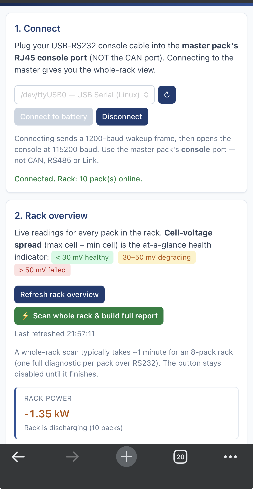

# Pylontech Battery Health Check

A simple, cross-platform tool that reads every cell in your Pylontech battery rack and tells you which packs are healthy, which are degrading and which are failing — in plain English, with no battery expertise required.

> **Free for personal and professional use** (including paid service-calls). You may not resell it, sublicense it, or bundle it into a paid product. Full terms in [LICENSE](LICENSE).

> **Disclaimer — please read first**
>
> This is an **unofficial** community tool. It is **not** affiliated with, endorsed by, supported by, or warranted by Pylontech Technology Co. Ltd or any of its distributors.
>
> The tool reads diagnostic data from your battery's existing console interface. It does not modify any settings, parameters or firmware. **However, you use it entirely at your own risk.** The author and contributors accept **zero liability** for any damage to batteries, BMS modules, inverters, cables, computers, property or persons; or for any voided manufacturer warranty arising from use of this software.
>
> Working on lithium battery systems carries inherent risk. If you are not competent and qualified to do so, **do not** open the rack, plug or unplug cables, or run diagnostic commands. If in doubt, contact a qualified installer.

---

## Why this exists

If you've tried to check a Pylontech US3000C, US5000 or similar rack with the official **BatteryView** software and hit Windows-only requirements, missing-USB-driver errors, missing serial-number reporting, or just wanted a clean report you can attach to an email — this is the cross-platform alternative.

It runs locally on **Mac, Windows or Linux**, reads the same console-mode BMS data BatteryView reads (cell voltages, **state of health (SOH)**, real cycle count, event log, per-cell SOH-abnormal counters), and produces a **warranty-claim ready report** in Markdown or PDF. The verdict engine is built around the cell-voltage spread / cell-imbalance signature that distinguishes a healthy LFP pack from a failing one.

Search terms this project covers: *Pylontech BatteryView alternative, Pylontech US3000C / US5000 SOH check, Pylontech cell voltage imbalance, Pylontech warranty claim report, Pylontech battery health check, RS232 console diagnostic for Pylontech.*

---

## What it does

- Reads every individual cell voltage in every pack in your rack
- Shows you the **cell-voltage spread** at a glance — colour-coded green / amber / red
- Identifies the **weakest cell** automatically (when the spread is meaningful)
- Reports the **BMS-calculated State of Health**, real cycle count, and per-cell SOH-abnormal counters
- Generates a **clean one-click warranty report** (Markdown + browser PDF) you can save, share with your installer, or attach to a service request
- Captures the **full event log** straight off the BMS for closer inspection
- **Whole-rack scan** — plug into the master and let it diagnose every pack with a progress bar

It does this by using the Pylontech BMS's own native console interface — the same data Pylontech's BatteryView software shows, just easier to read and runs everywhere.

---

## Screenshots

<p align="center">
  
</p>

*Tool running on a Raspberry Pi (always-on diagnostic node), viewed from a phone over the LAN. 10-pack rack online, discharging at 1.35 kW.*

A redacted **sample warranty report** is at [`docs/SAMPLE-REPORT.md`](docs/SAMPLE-REPORT.md) so you can see the format before installing.

---

## Easy to use (once installed)

1. Plug the console cable in
2. Open http://localhost:8080 in your browser
3. Click **Connect to battery**
4. Click **⚡ Scan whole rack & build full report** for an end-to-end report, or **Diagnose** on any individual pack

That's it. See [Install](#install) and [Run](#run) below for the one-time setup.

---

## Tested on

- **Pylontech US3000C** — 48 V, 15-cell, ~3.5 kWh, with stock BMS firmware (the `info` command reports a `B69`-series main software version). Verified.
- **Pylontech US5000** — 48 V, 15-cell, ~4.8 kWh, B69-series firmware. Verified.
- **Other Pylontech models** (US2000, US2000C, Force-L1, Force-L2, Phantom-S) — probably parse, not verified. If you try one, please [open an issue](#contributing--bug-reports) with the output of `info` and any failing command so the parsers can be adjusted.

---

## Works on Mac, Windows and Linux

The tool is a small local web app written in Python. It runs on your own computer — no cloud, no account, no telemetry. It opens in your browser at http://localhost:8080.

| OS | Notes |
|---|---|
| macOS 10.15+ | Tested. Port appears as `/dev/cu.usbserial-XXXXXXXX` (PL2303-driver clones may show as `/dev/cu.usbmodemXXX`). |
| Windows 10 / 11 | Tested. Port appears as `COM3` / `COM4` etc. FTDI / CH340 / CP210x drivers usually built in or auto-installed. |
| Linux | Tested on Ubuntu / Debian (incl. Raspberry Pi OS). Port appears as `/dev/ttyUSB0` etc. Add your user to the `dialout` group if you get permission errors (`sudo usermod -aG dialout $USER`, then log out and back in). |
| Raspberry Pi | Tested on Pi 4 / Pi 5 with Raspberry Pi OS Lite 64-bit. See [`docs/RASPBERRY-PI-DEPLOYMENT.md`](docs/RASPBERRY-PI-DEPLOYMENT.md) for an always-on remote-diagnostic node setup (systemd + optional Tailscale). |

---

## What you need

### A Pylontech battery rack

- US3000C, US5000, or any rack using the same 15-cell 48 V series with stock BMS firmware (**`info` reports a `B69`-series main software version**)
- The rack needs at least one master pack with the console port accessible

### A console cable

A USB-to-RS232 cable terminating in an **RJ45 (8P8C)** connector with the Pylontech console pinout.

**Verified working** — `uamdoen` US2000C / US3000C / US5000 Lithium Battery BMS Console Communication Cable (FTDI **FT231XS** chipset, 6 ft / 180 cm, USB-A to RJ45 8P8C). Other cables sold as "Pylontech BMS console cable" with an FTDI / CH340 / CP210x chipset should also work.

### A computer

- Any Mac, Windows, or Linux machine
- Python 3.10 or newer
- Modern web browser

That's it. No internet connection required to run the tool.

---

## Where to plug in

Pylontech master modules have several RJ45 ports. **Use the console / RS232 port — not the CAN port.**

- **Console / RS232 port** ✓ — the only port the tool talks on
- CAN port ✗ — wrong protocol, will return garbled characters
- RS485 / Link-up / Link-down ✗ — used for inter-pack stacking, not host comms

Plug into the **master pack** (the one wired to the inverter) for the whole-rack overview. You can also plug directly into an individual pack to get its full event log and authoritative per-cell SOH counters — useful when one pack needs deeper investigation.

If your wakeup returns garbled characters or no `pylon>` prompt at all, you are almost certainly on the wrong port. Move the cable.

For more detail on cable, ports, and master vs slave, see [`docs/HARDWARE-SETUP.md`](docs/HARDWARE-SETUP.md).

---

## Install

```bash
git clone https://github.com/simonpasley/pylontech-battery-health.git
cd pylontech-battery-health

python3 -m venv venv
source venv/bin/activate     # macOS / Linux
# or: venv\Scripts\activate  # Windows

pip install -r requirements.txt
```

## Run

```bash
python app.py
```

Then open **http://localhost:8080** in your browser.

---

## Troubleshooting — "no port shown" or "garbled output"

The single most common cause of "this doesn't work" reports is the **USB-RS232 cable's chipset driver** not being loaded by the OS, or the cable being in the wrong RJ45 port. Work through this list before raising an issue:

### macOS

```bash
ls /dev/cu.*
```

You should see something like `/dev/cu.usbserial-FT0123` (FTDI), `/dev/cu.usbmodemABCD` (CH340 / clone PL2303), or `/dev/cu.SLAB_USBtoUART` (CP210x). If your cable doesn't show up:

- **FTDI** chipsets (FT231XS, FT232R) — drivers built in since macOS 10.9. If the port is missing, replug the cable and check Console.app for kext-load errors.
- **Prolific PL2303** clones — Apple removed support for some clones in recent macOS releases. Check the chipset on the cable, then download the matching driver from Prolific (or buy an FTDI cable; more reliable).
- **CH340 / CH341** — install the driver from WCH-IC.
- **Silicon Labs CP210x** — install the VCP driver from Silicon Labs.

If the port appears but you get garbled output: you're almost certainly on the **CAN** RJ45 port, not the **console** port. Move the cable.

### Windows

- Open **Device Manager** → expand **Ports (COM & LPT)**. The cable should show up as `USB Serial Port (COMn)` (FTDI) or similar with an active COM number. If you see a "Unknown device" with a yellow warning triangle, the chipset driver isn't installed — install it from FTDI / WCH-IC / Silicon Labs depending on the cable.
- After installing the driver, unplug + replug the cable and refresh Device Manager.

### Linux

- Run `dmesg | tail` immediately after plugging the cable in to see which `/dev/ttyUSB*` it bound to.
- Permission denied? `sudo usermod -aG dialout $USER`, then **log out and back in** (re-login is required for group changes to take effect).
- Some distros use `tty` group instead — try that if `dialout` doesn't work.

If the cable shows up and the port opens but you get no `pylon>` prompt or only garbage: that's the wrong RJ45 port on the battery side. Use the **console / RS232** RJ45, not CAN, RS485, Link-up or Link-down.

---

## Usage walkthrough

### 1. Connect

1. Plug the USB-RS232 console cable into your computer.
2. Plug the RJ45 end into the **master pack's console port**.
3. In the tool, pick the serial port from the dropdown (macOS: `/dev/cu.usbserial-XXXXXXXX`, Windows: `COM3` etc).
4. Click **"Connect to battery"**.

The wakeup sequence sends a single 1200-baud frame (the documented Pylontech wake-up trick) and then opens the console at 115200 baud. You should see "Connected" within 3 seconds.

### 2. Rack overview

After connecting, the tool automatically pulls the rack-wide table from the master. You will see one row per pack with voltage, current, SOC, state, and **cell-voltage spread** (max cell − min cell) colour-coded:

- 🟢 **< 30 mV** — healthy
- 🟡 **30–50 mV** — degrading, worth monitoring
- 🔴 **> 50 mV** — at least one cell has a fault

### 3. Whole-rack scan

Click **"⚡ Scan whole rack & build full report"** to run a full diagnostic on every online pack and produce a single combined report. Takes about a minute for a typical 8-pack rack. When packs come back FAILED or DEGRADING, the tool surfaces a checklist of follow-up steps (plug into that pack, dump its event log) **above** the download button — so you don't email an incomplete RMA bundle to the Pylontech service team.

### 4. Per-pack diagnostic

Click **"Diagnose"** on any pack to run the full check. You'll see:

- **Verdict** — HEALTHY, DEGRADING, FAILED, or UNKNOWN (when the measurement conditions weren't valid — e.g. idle pack)
- **Why** — every reason that contributed to the verdict, in plain English
- **Live readings** — voltage, current, temperature, SOC, spread
- **Per-cell table** — every cell's voltage, delta from max, SOC, SOH-abnormal events, status
- **Lifetime statistics** — BMS-calculated SOH, real cycle count, alarm trip counters
- **Most recent stored event** — what the BMS captured most recently in its event log
- **Raw BMS output** — every command's verbatim response, in collapsible panels

### 5. Save a report

Each diagnostic and rack scan can be downloaded as a Markdown report or opened as a printable HTML page (Cmd-P / Ctrl-P → Save as PDF). See [`docs/SAMPLE-REPORT.md`](docs/SAMPLE-REPORT.md) for an example.

### 6. Capture the full event log

For each suspect pack, plug the cable directly into **that pack's** console port (the master's comm bus does not relay event-log queries to slaves), click **"Dump full event log"**, confirm the pack address in the popup, and the tool will produce a clearly-named text file.

There's also a slower **"Dump full event history"** that walks every stored item with per-cell readings — much more detail, takes a few minutes.

For more on what the numbers actually mean, see [`docs/INTERPRETATION.md`](docs/INTERPRETATION.md).
For warranty / RMA workflow notes, see [`docs/WARRANTY-WORKFLOW.md`](docs/WARRANTY-WORKFLOW.md).

---

## What the tool will not do

- Modify any battery setting, parameter, or firmware
- Replace official Pylontech BatteryView software for vendor RMA workflows that require it specifically (some Pylontech service teams expect BatteryView's exact export format — ask your distributor first)
- Diagnose physical issues like swelling, leaking electrolyte, corroded contacts, or thermal damage — always inspect the pack physically as well
- Cover packs that are out of warranty — those become a question for [ServTec UK](https://servtec.co.uk/) or another paid Pylontech repair service
- Connect over CAN, network, or wireless — console mode only, by design

---

## Limitations

- **Console mode only.** No protocol/CAN/network fallback. Console mode is the only one that exposes the per-cell SOH counters, real cycle count, and event log.
- **Per-cell SOH counters and event log do not propagate via the master's comm bus** when querying slave packs. For maximum detail on a specific pack, plug the cable directly into that pack's console port and re-run.
- **Verdict requires meaningful load.** The cell-voltage spread thresholds are only diagnostic when the pack is under at least light load (≥ 0.2 A), at moderate SOC (15–92 %), and warmer than 5 °C. Outside that envelope the tool returns UNKNOWN with a "re-test under load" hint rather than risking a false FAIL.
- **US3000C / US5000 firmware (B69-series) verified.** Other Pylontech models may need parser tweaks. PRs welcome.
- macOS uses `/dev/cu.*` ports (avoiding the `/dev/tty.*` DCD-wait deadlock).

---

## Project structure

```
pylontech-battery-health/
├── app.py                      Flask app — connect, rack, diagnose, report, eventlog
├── pylontech/
│   ├── connection.py           Serial port + wakeup
│   ├── console.py              Console commands + paged event-log dumping
│   ├── diagnose.py             Parsers + verdict logic
│   ├── report.py               Markdown report generator (with disclaimer)
│   └── models.py
├── templates/index.html        Single-page UI
├── static/css/style.css
├── static/js/app.js
├── docs/
│   ├── HARDWARE-SETUP.md       Cable, ports, master vs slave, troubleshooting
│   ├── INTERPRETATION.md       Every metric + thresholds + failure signatures
│   ├── WARRANTY-WORKFLOW.md    Diagnostic → form → RMA, scope notes
│   └── SAMPLE-REPORT.md        Redacted example warranty report
├── .github/ISSUE_TEMPLATE/
│   └── bug_report.md           Pre-filled bug-report template
├── requirements.txt
├── LICENSE                     Source-Available, No-Resale
└── README.md
```

---

## Contributing & bug reports

**Found a parsing bug on a different firmware version or model?** Please open an issue using the template at [`.github/ISSUE_TEMPLATE/bug_report.md`](.github/ISSUE_TEMPLATE/bug_report.md), or just paste:

1. Output of the `info` command (so we know your model + firmware)
2. Output of the failing command (e.g. `bat 1`, `pwr`, `stat`)
3. What you expected to see vs what the tool actually showed

That triplet is enough to write a parser fix without going back-and-forth.

PRs particularly welcome for:

- Parser tweaks for other Pylontech models (US2000C, Force-L1/L2, Phantom-S)
- Additional verdict heuristics
- Translations of the report template
- Windows / Linux testing reports

---

## Credits

Originally built by [Brunswick Electrical Services Ltd](https://bre-services.com) (Ipswich, UK) — out of the need for a quick, reliable way to check Pylontech battery health when the official BatteryView software was awkward or unavailable, and to document failures in clear plain-English reports.

Pylontech, US3000C, US5000 and BatteryView are trademarks of Pylontech Technology Co. Ltd. This project is not affiliated with Pylontech.

---

## License

**Source-Available, No-Resale.** Free to use (including for commercial diagnostic work — for example a battery installer running this tool to check a customer's pack as part of a paid service-call), free to modify for your own use, free to redistribute unmodified copies. **Not** permitted to be sold, sublicensed, bundled into a paid product, or rebranded as a paid offering. See [`LICENSE`](LICENSE) for the full terms.
